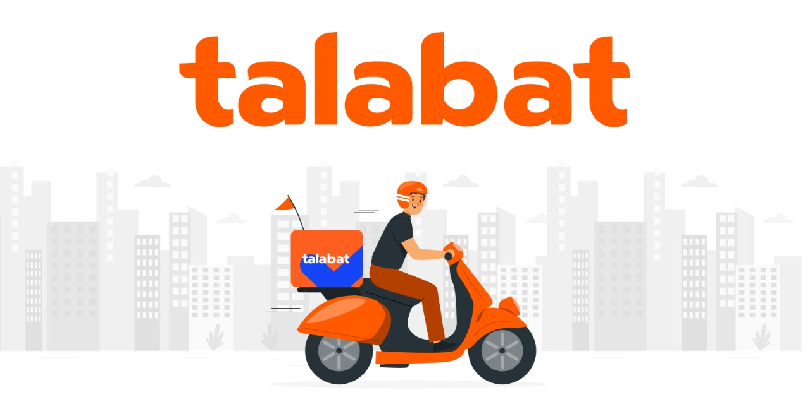

Project Describtion:
Our Talabat-inspired Food Delivery System is a Java-based application designed to simulate real-world food delivery operations with three main user roles: Admin, Seller, and Customer. The system focuses on providing a seamless experience for managing orders, products, and user interactions, with a strong emphasis on OOP principles, GUI design, and file handling.

🔹 Admin Role:

Full control over User Management: Add, Edit, Remove, and Search users by any field.

Access to Detailed Reports:

Number of Orders per Seller along with complete order details.

Identification of the Seller with the maximum number of orders and the one with the highest revenue.

Number of Orders per Customer and their details.

Identification of the Customer with the maximum number of orders and the one with the highest revenue.

Ability to view and analyze order details and calculate average and total revenue over specified timeframes.

🔹 Seller Role:

Complete Product Management capabilities: Add, Edit, Remove, and Search products by any field.

Access to Product Reports:

Number of pieces sold over a specific period.

Best-selling and highest revenue-generating products.

Management of Order Status, enabling Sellers to mark orders as 'shipped' once ready.

Analysis of Average and Total Revenue for specific time periods.

🔹 Customer Role:

Smooth Cart Management:

Create a cart, search for products, add or remove items, and provide delivery addresses.

Review payment information and confirm or cancel orders easily.

Access to their Order History:

View order details, track shipping status, and rate the experience after completion.
